# College Pocket

*Author: Haifeng Sun*

## 【高中版】序言

亲爱的朋友们：

当你看到这篇文章时，或许你正在埋头苦读、奋笔疾书，或许在认真思索科举制度的种种弊端与荒谬，又或者在感慨“世界是一个巨大的草台班子” —— 是的，此话千真万确。无论是学校围墙之内还是之外，世界都看似在支离破碎却仍勉强维持着，表面严肃，内里荒谬。但正因为它是“草台班子”，我们才拥有机遇与挑战，人生也才拥有更多可能。

我相信大家都渴望自由。很多同学幻想走出高中的围墙后，人生便会从此自由。然而自由不是一种处境，而是一种状态。高中时我过得很快乐，即便明天是省赛，我依旧在球场上尽情奔跑；即便马上高考，我仍会在温暖的阳光下看云卷云舒。就像《肖申克的救赎》中所言：“有一种鸟是永远也关不住的，因为它的每片羽翼上都沾满了自由的光辉。” 进入大学、步入工作、走向社会，不论物质条件高低，依然有无数人在焦虑、痛苦与内耗中度过。我希望大家记住：心静则清，事缓则圆，只有享受过程的人，才能真正享受结果。

我仍要真诚地告诉大家：高考是美好的——即使此刻的你们未必能理解。高考是你们最后一次能参与的、绝对公平、选择权掌握在自己手中的竞技。当你们走出这座公平的象牙塔，离开家庭的呵护，走向复杂残酷的社会时，彼此人生的方差会急剧扩大。你们未来面对的每一场竞争，都将伴随着利益与人脉、金钱与身份，甚至种族与性别的差异和不公。到那时，大家会明白“公平是美好的”。同时，我也希望把世界的温柔美好的一面带给大家，让大家在枯燥的备考生活中，看到希望的光芒，看到诗和远方，看到属于自己的明天。

最后，希望大家成为一个长期主义者，一个热爱生活的人，一个积极阳光、无可救药的乐天派。

Shanghai,

Haifeng Sun

  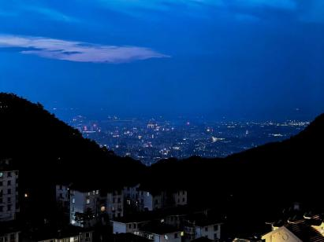

  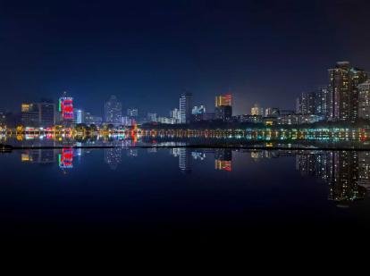

  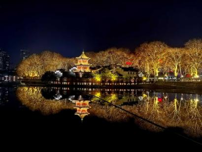

## 写在前面

我出生在一个风景如画的小城——九江。推开窗，就是滚滚长江；站在阳台，就是秀美庐山。湖泊星罗棋布，开车不远就是鄱阳湖。这里民风淳朴，生活和谐，每每回想，总有种像乌托邦般的感觉。无怪乎，当年九江的陶渊明便写下了《桃花源记》。这个世界上，除了苏黎世、杭州、西雅图等等，恐怕很难找到能与之媲美的地方。

我人生中最大的贵人，就是我的父母。我的家庭几乎可以称得上完美，以至于不少人开玩笑说愿意用一生所得换一个像我一样的幸福家庭。善良是我们的家风，这也让我的父母在当地非常受尊敬和爱戴，使我在童年收获了无尽的关爱和呵护。父母知足常乐，那种如水般的生活哲学，也潜移默化地影响了我。在我的印象里，我从没和父母或其他人有过矛盾争执，他们也是一样。

当然，我很早就发现，知足和规避风险的观念也让投资策略一直比较保守，这在某种程度上限制了高速发展。他们时常教我生活的道理，强调自由与休闲，引导我读经典、看世界，他们好像从不在意我的成绩，也从来没问过我的排名。有时候，我甚至觉得他们不喜欢我去学课本知识，也不喜欢我参与竞争？后来想想，或许他们认为，人生中有许多比学习、考试重要得多的事情。

小学时，我无忧无虑地玩耍，沐浴在阳光下，度过美好的童年时光；初中两年半，是我学习生涯中比较认真的时期，这种状态一直持续到初三确定去向。初三下，在南昌中考，裸考顺便赚了几万块奖金。高中在南昌，前面一年多，主要搞竞赛，拿了一个物理省一，后来考虑到兴趣和风险，剩下的时间，我在正常高考节奏中度过。

高考完参加清华强基，凭着不错的评级和校测、高考成绩，理论上没问题，但因为祖国经典的宏观调控等原因未能如愿。最终，在各种机缘巧合下，我进入了上海交通大学的大门。

  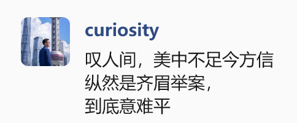

  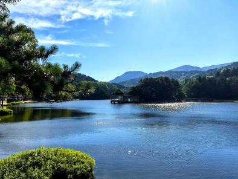

  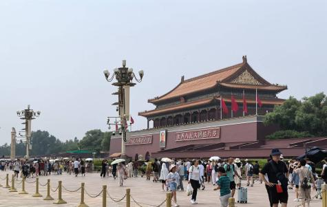

## 暑假

高考后的那个夏天，像一扇骤然推开的窗，涌进来的是整片世界的风光云影。

通往远方的列车呼啸而过：重游北京，骑车穿过老北京的街巷；带挚友登临庐山，在故乡的云雾里成为他们眼中的向导。一场场升学宴，在觥筹交错中，我既是主人也是宾客，一次次重逢昔日同窗，有些情谊从未被时间冲散。两次去上海，金碧辉煌的外滩，极致现代化的陆家嘴——这座城市用它的繁华与开放，向我低语着未来的可能。偶尔回忆过往，也会感慨自己是极度幸福、幸运的人 【附录三】。

我也曾窥探外面的世界，YouTube、X等等，与主世界取得联系；广泛涉猎书籍，探索万千世界，为进入一个新生活愉快地准备着。那个夏天我像一块贪婪的海绵，吸收着一切陌生的养分。当然，也记得驾校烈日下滚烫的方向盘，顺利但不情愿地考完了科一科二。

而所有记忆中最鲜明的，是“自由”第一次具体可感的形态。当多年紧绷的弦忽然松开，当我不必再追赶任何人的钟表——呼吸到的风是甜的，云走得那么慢。站在十八岁的路口，我感到人生不再是一条轨道，人生是旷野！

那个夏天，我带着乌托邦故乡给予我的底色，一头扎进真实而广阔的人间。心底始终怀揣着温暖，去走向那个复杂多元，充满着黑与白，金钱与汗水，利益与情感的新世界。

  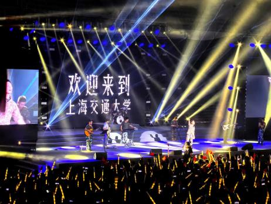

  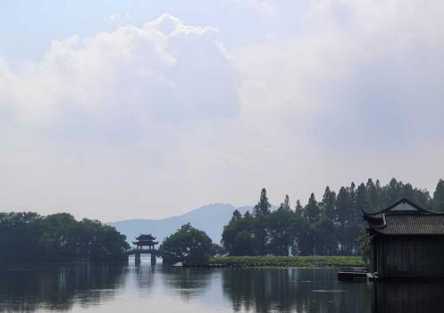

  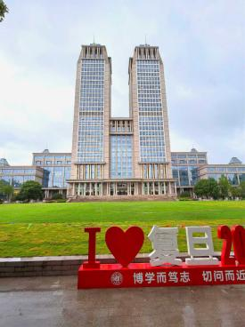

## 大一上

初入交大，一切都是那么的新奇，况且是交大这样美丽的大花园：晨曦中的植物园，思源湖畔的白鸽，钟楼下的梅花鹿，各式的图书馆展览馆体育馆，数不清的食堂，都给了我莫大的新鲜感。当然我也暑假提前熟读《上海交通大学生存手册》，明确了大学的各种投机与玩法，我们教育的各种弊端与应对策略，即便如此，也无法浇灭新鲜感所带来的热情。军训去了第一天，太阳有点晒，我果断申请政工——成为了不受管束的画家，我的任务也从极不情愿地服从指令变成了自由的出现在各处开始画水彩画、彩铅画，悠闲的日子一天天过去，军训结束时，我也送给学校了一整套印画的明信片。开学前举办了各类活动：开学典礼、新学期的演唱会（超棒）、致远楼的大party……初入大学的我对新生活相当满意。

国庆假期如约而至，北京的老友飞抵上海。我们漫步于交大、复旦、同济的校园，挤过人潮汹涌的南京路，并肩坐在流光溢彩的黄浦江岸，让心事随着江风飘远；也在梧桐掩映的街角不紧不慢地喝一杯咖啡，或干脆躺在草地上，任由秋日阳光将全身晒得暖洋洋。那几天快乐得仿佛一瞬，却留下了绵长的回甘【附录四】。平日，与同在沪上的九江、南昌旧友也时常相聚，吃饭、散步、唱歌、看电影……这些带着乡音的陪伴，成了异乡生活中柔软的慰藉。不久，学校因承办国创赛放假，我与朋友们相约再访杭州。湖光山色，浙大校园，西溪湿地……让杭州在我心中跃升为中国最宜居的城市，最后带着厚礼依依不舍地返回。期间，不少远方的朋友们特意来访，我们共乘游轮看两岸繁华，细赏豫园精巧的飞檐，在寝室深夜畅谈……每一帧，都成了记忆里珍贵的收藏。

大一的我经常去上课，也是我还有时坚持上早八的时段。我热情的摄取知识，积极思考，从CS自学指南到MIT线性代数，从C++ Primer Plus到各类讲座。我天真地以为认真上课、认真写题就能维持不错的成绩，后来发现当时的我还是太天真，太认真了。最后这个学期的课业成绩很一般，不过也让我非常清醒的认识到大学课本的学习投机取巧最为重要，要把时间精力放在更重要的事情上。自我感觉做得比较好的一点是我最开始就确定了北美PhD的规划，自此所有的学习都是明确地朝着这个方向，我广泛听讲座，吸取不同成功者的经验，认真研究路径，拓展出很广的边缘社交圈……所有的努力，都朝着大洋彼岸那遥远的灯塔。

电院分流考试确定专业后，我立刻确定了robo这个感兴趣的研究方向，在一番斟酌后，大胆地加入IWIN-FINS实验室，幸遇良师益友，我们常在实验室里学习、吃饭、聊天。我开始系统补足机器人知识：导论，代码，数学，工具，组装等等，在偏底层的机器人开发上面打下了不错基础，实验室一起养的一只可爱的垂耳兔也成了平凡日子里的一抹柔软的亮色【附录二】。此外，还参加了华为全链接大会和进博会，看看热闹，新鲜乐呵。总之，感觉一切都蒸蒸日上，一切尽在掌控之中。

岁末的跨年晚会，像一场盛大的青春仪式。我与朋友们置身其中，在音乐与欢呼中告别过去的一年。当零点到来，璀璨的灯光照亮每一张年轻的脸庞，那一刻的喧腾与温暖，深深印在了记忆里。站在年岁的交界处回望，这一年所经历的种种：百日誓师、高考、强基、旅行、探索、收获、感动……都悄然化作星空下绽放的烟火。我们相视而笑，知道纵前路漫漫，但此刻的温暖与共鸣，足以照亮许多个灿烂的明天。

  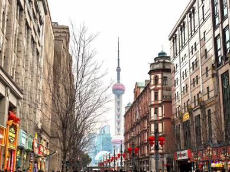

  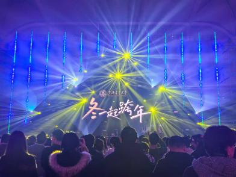

  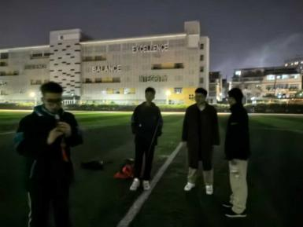

## 大一寒假

寒假伊始，我便如约回到南昌。旧友重逢，宴饮欢聚如昔；我们重走环艾溪湖的徒步路线，在冬日稀薄的阳光下奔跑踢球；入夜后，大家围坐聆听文韬的笛声，仰望满天繁星，谈论着遥远的人生与理想。夜深时一起去吃烧烤、唱整夜的歌，每一次都尽兴而归……也去看望了老师，去不少班级讲讲课，试着把外面世界的风，轻轻吹进高考工厂。

那样的日子轻盈得像浮在光里的尘埃，转眼就飘散了。走过校园，看见伏案疾书的高中生，仿佛昨日重现 —— 只是站在窗外的我们，早已换了心境，也换了目光。

朋友们一路送我到地铁站口。我在春运拥挤的人潮中独自前行，回到那座如理想国般安静栖息的故乡。从年前到元宵，日子浸在熟悉的年味里：我的日常就是和故乡的老朋友们在全城各处玩乐，去亲戚家拜年串门，攀登庐山，接待专程到九江看望我的各地朋友… 玩乐之余我也会认真进行科研学习，ros1/2，Linux系统，自动控制原理，现代控制理论等等硬核的robo书籍……都是寒假抽空学完的。

除夕至初三，我家便是亲友欢聚的殿堂。杯中酒满，窗外烟花绽成一夜星河。绚烂虽只一瞬，但人间烟火不息，温暖人情长明。

  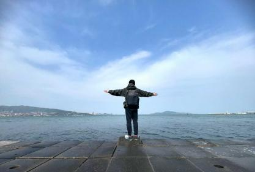

  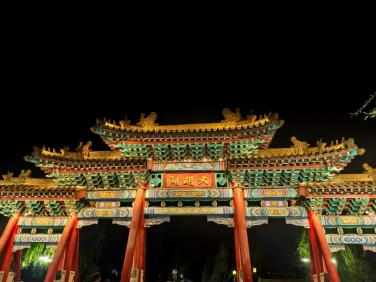

  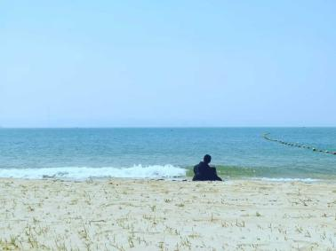

## 大一下

春风十万里，吹来了课业最繁重的学期。好在我有很强的适应能力，我常说，劳斯莱斯我爱坐，骑共享单车我仍然不会错过沿路的风景；米其林餐厅我爱吃，一个干馒头一瓶矿泉水我也能吃得津津有味；独栋别墅我爱住，在地板上以包为枕我也可以香喷喷的睡一晚；二十学分的学期我喜欢，四十多学分的大一下我依然能从从容容，游刃有余。

即便在课程十七八门，稍不留神任务就堆成山的学期，遗憾的是，我早上仍然起不来。所以八点的课基本没去过，其他课也是挑有需求的去，毕竟课业可不能影响我吃喝玩乐的大好青春（偷笑）。考前稍微过一遍，各科最后都取得了不错的成绩。

科研上，作为机器人控制科学大创项目的总负责人，我招募不同专业的本科生一起搭建了伟大的FinesRobot舵轮机器人，设计了Finemote自主机器人系统和滑移控制模型。同时，学期的末尾，在学长的帮助下，我跳槽到了人工智能学院、上海创智学院院长的实验室（他也是AI教母—李飞飞的大弟子），研究方向也从偏底层数学模型的控制转向了当下热门的具身AI。

五一我特意多请了几天假，与几位老友相约山东，受到东道主的盛情款待。在威海，我们于海滩边追逐浪花，品尝海产；一同登上游轮，在呼啸的海风中凭栏远眺。而后转至济南，穿行于温润古朴的大街小巷，在大明湖畔依依的垂柳下，我们从往昔聊到当下，又漫谈到遥不可及的未来。最后在车站不舍的告别，把一段鲜活的时光轻轻叠好，收进了行囊。

大学以来，有时也会有一些向我表明心意的朋友，作为长期主义者，每一次我都会耐心的跟对方讨论是否适合（交大的女生普遍都太优绩主义，太要强了，hhh）。

十九岁生日那天，百余份祝福漫过聊天框，字字温热；世界各地的感谢信如手写的月光，静静铺满邮箱。一份份礼物，仿佛是时间替我收藏的、大家散落在人生汪洋里的温柔回响【附录三】。原来被人记得，是这样一种感觉——像雪夜归家，用钥匙轻碰门锁的刹那，整条巷子里的温黄灯光，都为你亮了起来……

这一年经历了很多的事，看到了真实世界的光与暗。我们要学会同情那些品行不端的人，受制于眼界和认知，他们没有办法追求长远的利益与幸福，也不必好为人师，因为你所能提供的只有同情的目光，幸福者往往要退让。我们要时刻铭记感恩每一个为我们生命点灯的人，感恩他们的付出与善意，感恩他们的理解和支持，因为他们，世界变得更加美好。尽己所能的帮助每一个人，这个世界上，无数人还在生存线上苦苦挣扎，多买一杯饮料给路边满面尘灰的工人，真心地大声赞美给你提供服务的人，停下匆忙的脚步向深陷困境的人伸出援助之手……对你而言或许只是一次尊重、赞美与援助，对他们而言你可能是一束光，照亮了他们的一天，甚至整个世界！

We are the world        We are the children

We are the ones who make a brighter day, so let's start giving！

  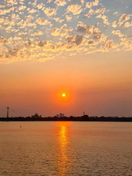

  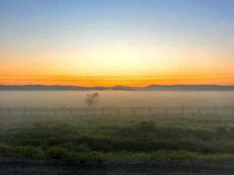

  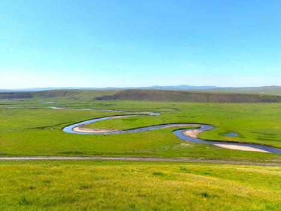

  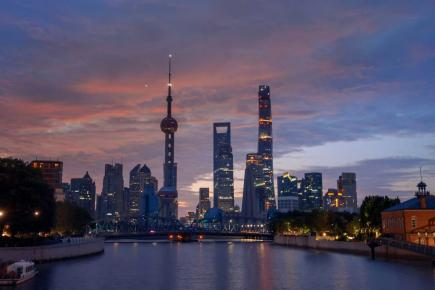

  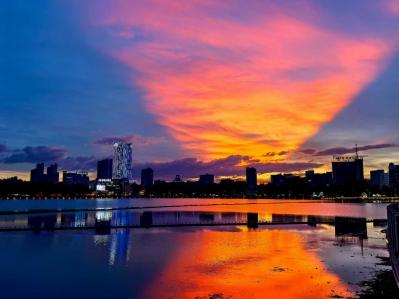

  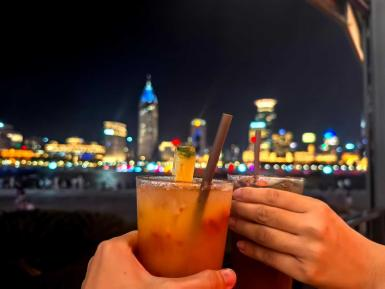

## 暑假

那个夏天，我放下了夏季学期的课程，与英国和上海交大的好友们一同飞往北方。哈尔滨的松花江上，落日将天空染成一片温暖的绯红，像未完的诗行漫过天际。之后我们深入内蒙古，呼伦贝尔的草原在眼前无限铺展，河流如碧绿的丝带蜿蜒出九曲回肠，成群的骏马奔过，仿佛能听见大地的心跳。异域的俄罗斯宫殿金碧辉煌，藏传佛教的白塔静静立于苍穹之下，每一步都踏在新鲜的光里。

回到上海人工智能研究院后，我静心补足机器学习、深度学习、强化学习、大语言模型与智能体相关的知识，为后来的AI研究默默铺路。和硕博一起搭建Robopano全身视觉机器人时，扩散模型难以调通，研究陷入僵局。也就是在那段时间，我的重心悄悄从科研，偏转向了对投资的探索。

我开始接手家里的一小部分生意，泡在图书馆，阅读金融、投资、理财与社会学的经典。采访知名投资人的记录，后来我也开源分享。作为一个长期主义者，我延续了价值投资的底色，但也在策略上做了大胆转向——踏入中高风险领域。每一次错误决策都可能让几十万流动资金灰飞烟灭，那种如履薄冰的处境，磨炼着我的胆魄与耐性。

盛夏渐深，老朋友从各地陆续来到上海。我们走过武康大楼的转角，走过人潮汹涌的南京路，站在陆家嘴的空中花园上看高楼大厦铺满天空，在徐家汇的夜色里谈笑。忙碌间隙，趁着三个月长假，我回了一趟故乡九江。日子被朋友的邀约填满，夏天就这样被染成了充实悠闲的画面。

坐在黄浦江边，看陆家嘴的摩天楼群在暮色中连成一片闪光的岸，听海关大楼的钟声沉沉传来，忽然觉得，在这十里洋场烟花地，风云际会上海滩，我们不过都是时光里短暂而平凡的旅人。回首来时路，渐渐明白，自己并非聪明，也不努力，能走到这里，大抵只是因为——在恰当的时刻，遇见了恰当的人，侥幸做了一些恰当的事而已。

  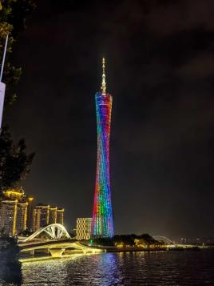

  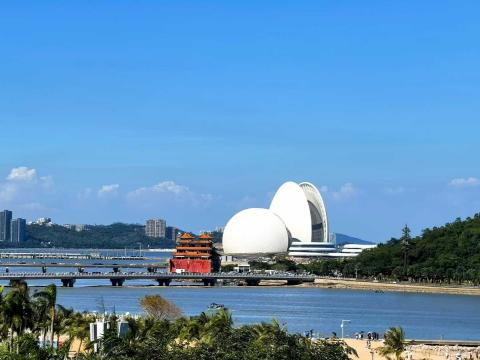

  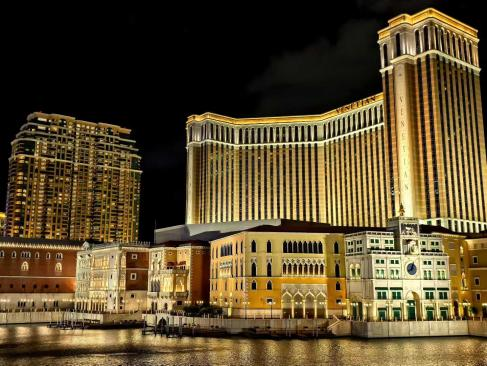

  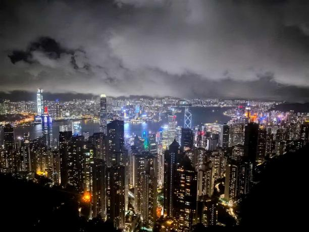

  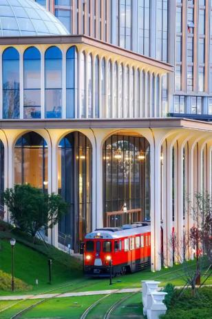

  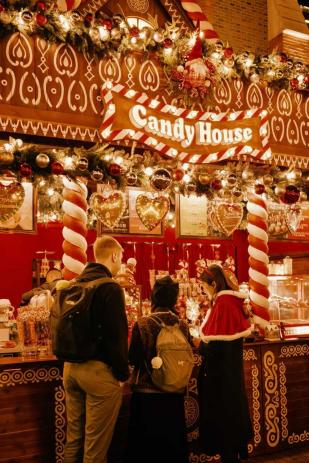

## 大二上

开学不久便逢国庆，我请了几天假，凑成一段十日的闲暇。时隔十年，再次飞往粤港澳珠三角。一路东道主们盛情款待，于是广州的美食、珠海的海风、深圳的高楼，逐一在回忆里铺展。澳门的氹仔繁华如梦，本岛漫着异国情调，赌场里光影流动，令人微醺。而我最留恋的，仍是港乐港影里那缕熟悉的港味——在太平山顶看维港灯火流转，穿行于油尖旺老街区，时光仿佛慢了下来。甚至在中环汹涌人潮中，一个idea悄然降临，默默推动了我之后的学术旅程。

之后，在导师推荐下，我于剑桥大学做intern。与剑桥博士、清华状元一起，我们搭建了目前4D点云视频理解领域最具潜力的大模型。同时，交大课题组里的具身智能项目也在坎坷中一点点推进，渐渐有了起色。中途曾有过和北卡的合作，因精力有限而暂停。闲暇时，我秉持“己欲立而立人，己欲达而达人”的理念，带本科生做科研，帮他们梳理方向，走稳最初几步。

我也走出学术的围墙，去扩展工业界的connection。微软、苹果、华为、米哈游……拜访它们的总部，和研究工程师们聊天，听他们讲述AI浪潮下市场与产业的剧变。我也较早的开启了Internship Application，策略是广套磁，由于美国甚至国际学术圈对中国国籍有着较大的限制和偏见，外加Trump右翼政府的砍funding，反移民政策，申请过程变得异常困难。当然，在种种显性和隐性的歧视下，结尾还是有惊喜。机缘巧合下，面试拿下了美国多个TOP校TOP导，麻省理工AP（UMD/USC），剑桥 senior professor（return offer） ， 新国立明星AP（亚洲Top）的 on-site intern offer。有幸成为极少数能来访的中国人，希望能顺利通过美联邦政府漫长的安全审查，毕竟一个弱不禁风的本科生怎么会造成国家安全威胁？

世界正面临一场剧变，计算范式的改变将掀起一场前所未有的科技革命，强度将远大于蒸汽机，电和互联网。我们曾经坚信人类独一无二、不可替代，然而这仅仅是一种愚蠢的傲慢，事实上没有一种属性是人类所独享的。在时代的十字路口上，人类将第一次面临远超越自己的智能体（智能的本质在于学习），他们拥有极高的信息共享效率，规模化迭代优势，他们在芯片上永生。

然而遗憾的是，我们并没有准备好。大规模失业浪潮即将来临：翻译、销售、教师、码农等大量职业将面临剧烈缩减；我们是最后一代有需要掌握知识的人类，不久后知识的稀缺性不再，拥有知识所象征的地位与尊重不再，强迫人们掌握知识的社会驱动不再；在科技的加持下，贫富的差距将扩展到力量、生理与寿命，扩大至人与“神”的鸿沟。如今，这一切，正在华尔街交易所的曲线、英伟达园区的计算与特斯拉工厂的脉动里，不受控制地成长着……

## 第一期结语

2025年即将远去，此刻我正在空荡飞驰的地铁中，做着年终的记录。

偶然间，透过玻璃的反光，恍惚中，仿佛跨越了时空——我看见那个意气风发坐上地铁、步入崭新生活的自己，看见高中时满怀期待、等候列车出游的自己，看见儿时天真活泼、不知忧虑的自己。飞驰的列车仿佛从故乡驶来，一路延伸，辐射向世界的各个角落。

如痴如醉，不禁感慨万千，意外地写成了Bio。College Pocket（出自Summer Pockets）自觉恰当，遂以此为题。

广播中，紫竹高新区到了，我也该下车了……

## 写于上海地铁

二零二五年十二月十日

  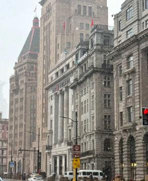

  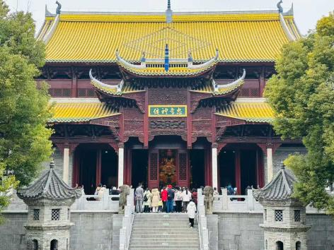

  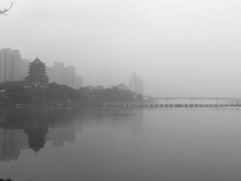

## 大二寒假

期末的烟方才散去，北京与杭州的老友们便如约抵沪。仿佛是为了迎接，上海竟罕见地飘起了鹅毛大雪。我们站在上海中心大厦的云端俯瞰，整座城市繁华如梦；从漫天飞雪的黄昏到浦江两岸流光溢彩的霓虹，切实体会“高处不胜寒”的广阔。

而后，带着满身雪意，我们回到南昌。游历旧景，重返母校，老朋友们重逢的欢愉恰如“桃李春风一杯酒，江湖夜雨十年灯”。给学弟学妹们的分享，我讲述着我的世界观，为他们掀开通往未来旷野的一角。

回到九江 ，似乎感受到了一股独属江西的萧条。看书，社交，学习，运动，游戏，品尝山珍海味便成了生活的日常。与剑桥、清华合作的4D点云视频理解迎来收官，控制领域的相关研究也在稳步推进，甚至在上学前天拿到了驾照。受签证的影响，暑研从东海岸的华盛顿转移到了西海岸的洛杉矶，与MIT/USC的老师们更广阔的合作机遇与更充裕的资源也随之而来，命运的伏笔似乎总在将一切推向更好的方向。

新春伊始，家人、挚友们再度重逢。夜幕降临，甘棠湖与南门湖畔花灯如昼，眼前的绚烂完美印证了那句“东风夜放花千树。更吹落，星如雨。宝马雕车香满路。凤箫声动，玉壶光转，一夜鱼龙舞。 蛾儿雪柳黄金缕，笑语盈盈暗香去。”这充满烟火气的人间，依旧如此滚烫而美好。

  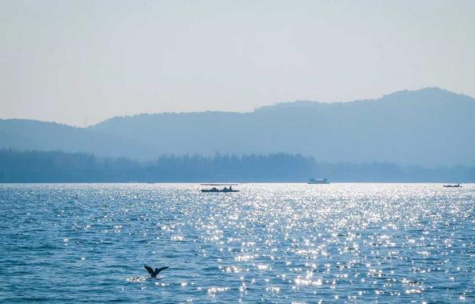

  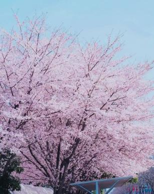

  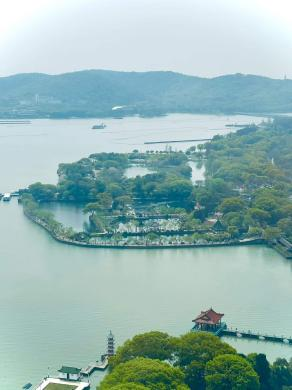

  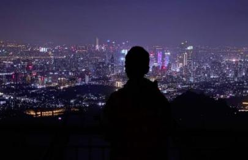

  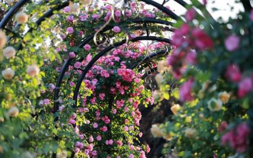

  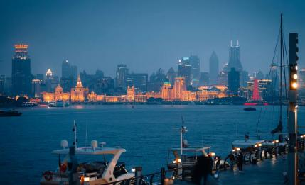

## 大二下

开学前几日，2026 ECCV 终于投稿。漫长的修改、实验、写作与讨论之后，按下 submit 的那一刻，只像一阵风轻轻吹过，心里忽然空出一大片地方。和 US 的 F 教授安排完接下来的任务后，我便心安理得地进入了抑制不住的长期开摆。

三月春光明媚，我又去了杭州。西湖畔“绿杨烟外晓寒轻，红杏枝头春意闹”，飞来峰与灵隐寺之间，石刻、古木、香火与游人交错，让人感叹文化深处自有一种安静的力量；钱塘江边，水天开阔，远处城市层层铺展，仿佛真有参差十万人家。F1 期间去看赛车，轰鸣声从看台前掠过，速度与激情竟也有一种近乎精密的艺术。闲来流连于浦东美术馆、徐汇西岸，也带家人游览上海。春天的上海总是很慷慨，江风、梧桐、展馆、街角的咖啡与人潮，都足够让人暂时忘记赶路。

清明春假，与朋友们去无锡太湖鼋头渚赏樱花桃花，可谓芳草鲜美，落英缤纷；夜里又去爬南京紫金山，紫色的天空下，城市灯火在远处缓慢起伏，像某种巨大的呼吸。五一假期，我和朋友们乘船来到舟山嵊泗岛，沿着海岸线骑行，迎着呼啸的海风，餐餐都是美味海鲜。返程的船上看见橘子海，天色一点点沉下去，海面却像被夕阳点燃。那一刻忽然觉得，很多事情或许没有那么沉重。论文打分并不高，失落当然是有的，但完善工作后又转投了 NeurIPS。科研大概就是这样，热血、挫败、修修补补，然后继续出发。

这一学期也有幸得到许多高人的指点和帮助，常有“高山仰止，景行行止”之感。越往外走，越会意识到世界之大、强者之多，也越能明白一个人真正应该经营的东西，不只是成绩、论文或履历，而是判断力、行动力、信用、作品，以及持续向世界交付价值的能力。于是我也开始更认真地把项目、想法、文字与经历慢慢整理出来。过去总觉得社媒只是记录，后来渐渐觉得，这也是一种公开地存在：把自己放到更大的世界里，让作品替我说话，让偶然的连接有地方发生。

OPC，一人公司的想法，也在这段时间反复浮现。一个人当然不是传统意义上的公司，但一个人如果能管理自己的时间、现金流、表达、作品、技术与信用，能不断发现问题、解决问题、把结果交付出去，那他其实也已经是一个小小的组织。某种意义上，未来真正重要的能力，也许不是加入一个系统，而是把自己变成一个可以长期迭代的系统。

端午节去看了两场哈利波特，又走遍上海大街小巷。后来参加 26 年的毕业典礼，忽然感觉毕业已经咫尺之遥；高考出分时，又觉得我们仿佛才刚刚进校。大学里的时间总是这样奇怪，当你身处其中，它像一个漫长的春天；当你回头看，它又快得像江面一闪而过的灯影。

钱是无比重要的。钱是自由，是选择权，是试错空间，是把想法推向世界的燃料。但人生的乐趣和意义又绝不只是赚钱。我一直不明白，What is value? 探索思考了挺久，目前的答案是：Value is joyfully finding and solving a real problem, and then commercializing it at scale.

和 F 教授的工作也在逐步推进，有了 idea 和项目的框架。看似松散，实则许多东西都在暗处生长。春天把我从一段紧绷的科研里暂时释放出来，又在风景、朋友、海岛、城市与一次次谈话中，把我推向更具体的野心。

## 附录一

Web: https://haifengsun.netlify.app/

作品: https://github.com/supercuriosity/portfolio

Email: curiosity123hf@gmail.com

I use my authentic identity across all major social media platforms. If you want to contact me, please email me rather than direct message on social media (except WeChat). Thank you!

本人言论自由受宪法第一修正案保护

My opinions are protected under the First Amendment of the Constitution.

本人所有作品以及科研项目均会在合适时间选择开源，详见 https://github.com/supercuriosity

  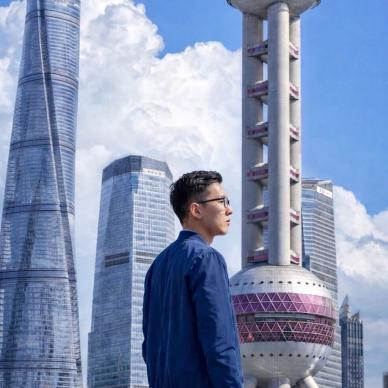

  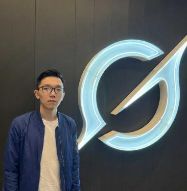

## 附录二

### 【2024圣诞随笔】

记得儿时圣诞节，家里会放上一个圣诞树，装饰，灯光和家人陪伴着，温馨祥和。我在树边回顾这一年。如今独自在外，这种感觉却又如此亲切真实。这圣诞树的光晕隐隐约约透着一抹九江的月光，南昌的街灯，波士顿的穹顶和上海的霓虹。

转眼又到了平安夜。去年在南昌的平安夜和00班同学们在语文周练中度过，高三的时间一闪而过，转眼就是百日誓师和黑板上递减的倒计时。接着就是义无反顾的走向高考，一眨眼到了高考出分，一切就像梦一般，当时切身体会，醒了就只剩下断片的回忆，不论结果是否尽人意，我始终感激那段激情燃烧的岁月，让我在困难中渐渐成长，也感受到了温暖与关怀。

7月5号是人生中难以忘却的一天。人事归结不应该归为天意，毕竟不是有的东西不是一场概率游戏。让我刻骨铭心的意识到“陆本只是跳板”不是无稽之谈。至今三个清华教授的发问仍然富有戏剧性：“对比中美科研差距”。有的时候真是感慨：时代的一粒风尘，落在个人的身上却是千斤重担。不过，我感谢这一天，它揭示在权利与利益面前个体的渺小与无助，让我在发展走向问题上变得前所未有的坚定不移。

暑假走了很多地方，重游北京，和高中的朋友们庐山度假，和Jason去了上海，于杭州流连忘返…一路上有活泼可爱，富有生命力量与思想的朋友们相伴。一边感叹酒逢知己千杯少，一边读万卷书，行万里路，感叹人生如旷野。

转眼来到上海交大，大学之大，多元并蓄。奔赴而来的再也不是固定的赛道，而是整个世界。大学的蜕变首先是思维认知的转变（人永远赚不到认知之外的钱），对利益，对人际，对社会，对科技等等的理解的进一步深刻。所看到的世界越大，“野心”与“欲望”这两股令人畏惧的力量愈发强烈起来，我能感觉到他们将原来的思想逐渐瓦解并重新组织。我敬畏于他们的力量，同样时刻警惕着他们以不可抗拒的力量将主体拖入深渊。大学的生活更充实，更自由，更快乐，更让人成长。不变的是，我始终对我拥有的一切感激不尽，始终对自然与生命无比赞叹，始终相信前途一片光明。

年末，在IWIN-FINS实验室里，我遇到了一群博学而疯狂的朋友们。在席望和方鹏杰等热心的学长们（超棒）手把手的指导下，我饥渴地摄取知识与技能。当然，最为疯狂的科研者非垂耳兔莫属，在她眼里，人类愚蠢的论文吃起来还不如窝里的草。我感激拥有这样一个以科研为导向的学习的机会，让知识和思维变得鲜活起来。

回想起一路相伴的可爱真诚的朋友们，无条件坚定支持我一切选择的家人，古今深邃的思想，妙不可言的理论，伟大的自然与科技…凡此种种，给我的世界带来光明与希望。我觉得生命是美好的，温暖的，充满活力与意义的，就像今夜的夜空般繁星闪烁。

## 附录三

### 【十九岁生日随笔】

不知不觉过了18个春秋，迎来了人生的第19年。我常常觉得自己是个幸福的人。

“人生得一知己足矣，斯世当以同怀视之”在人生旅途中，遇到了太多知己与真心朋友。真正理解我、从不设限地支持我，启发我及时行乐的父母；一路走来不离不弃、共同成长的伙伴；活泼可爱，宛如兄弟姐妹的同学们，在我迷茫时为我点灯引路的人生导师……也感谢我未曾谋面，甚至不知尊名的贵人，在关键时刻频频出现，给予我莫大帮助。上帝说要有光，光就来了。你们是光，照亮了我的世界。人的本质不是单个人所固有的抽象物,在其现实性上,它是一切社会关系的总和。“与有肝胆人共事”，跟你们探讨宇宙，人生价值，也是在寻找真正的自我。我开始理解为什么爱因斯坦在《我的世界观》里写下“人都是为别人而活着的”，体悟“海内存知己，天涯若比邻”是幸福而非悲凉，默念每一次挥手告别时“莫愁前路无知己，天下谁人不识君”的真挚祝福。

“艺术来源于生活又超越生活”对真善美的追求，对自然与创造的歌颂，对伟大而崇高精神的赞美，凡此种种，都是我生存的动力。“我步入丛林，因为我希望活得有意义，我希望活得深刻，汲取生命所有的精髓！把非生命的一切全都击溃。以免在我生命终结时，发现自己从来没有活过…”诗词，音乐，书画，让我感受到生命的充盈，热烈与美好。正如My Captain所言“我们读诗写诗，非为它的灵巧。我们读诗写诗，因为我们是人类的一员。而人类充满了热情。医药，法律，商业，工程，这些都是高贵的理想，并且是维生的必需条件。但是诗歌，美，浪漫，爱，这些才是我们生存的原因。”生活是艰难的，重复而乏味着。艺术的力量引领我们跳出平静的绝望，让我们真正感受到青春，感受到美与创造，感受到宁静，感受到风雨，而非只是被淋湿。

“你所热爱的就是你的生活”小时候每次旅行前的憧憬，旅行时的兴奋，旅行后的惆怅，如今还依旧保存着。这一年我跨越山海，探索着未至之境。“世界这么大，我想去看看。”我梦想着趁着年轻，环游世界。青春时的心境，热情，生命力是不可复制的。所以我常以为，对明天的一切馈赠就是把一切献今天。往事总在回忆时被赋予意义：日复一日的生活圈中，总感觉时间飞快，在记忆的长河中随风消散。而那些跳出圈外，飞驰旷野的点点滴滴，深深印在脑海中，成为了宝贵而幸福的回忆。记忆很是神奇，往事如烟，但回忆中剩下的总是那些美好的，精彩的，闪光的。使我可以发自内心随时自豪地说道 “我过着幸福的一生。”

“我们一路奋战，不是为了改变世界，而是为了不让世界改变我们。”这一年，世界在以肉眼可见的速度崩塌和重建。俄乌鏖战仍在继续，弱小种族危在旦夕，多边主义困难重重；经济下行，人口结构问题难以解决；某国NSF资金削减，（这里本来还写了，介于最新的check制度只能删了）……个人只不过是时代的一粒灰尘。变革常常令我兴奋，它意味着混乱、碰撞，同时意味着新的机遇和市场，但同时激发着对人类苦难不可遏制的同情和对过山车般人生的迷茫。时代的经纬千变万化，在世界巨变中寻找内心不变，坚守自我，乃心之所向。我始终以为“达则兼济天下，穷则独善其身。”马斯克用财富进军星辰大海，梭罗在瓦尔登湖畔体悟自我，凡斯种种，都是精彩的人生。“存在先于本质。”人生是不可量化，不可对比的，它不是一场苦行，西西弗推着巨石都能创造音乐，人生的乐趣在于创造与改变。生命没有轨道，人生就是旷野。如果执意要对人生的意义寻根问底，我倒觉得人生的意义在于“好玩”，做一件事情单纯是因为这样更有趣，更好玩，管对与错呢！

wish：Heal the world, make it a better place.

## 附录四

### 北国的旅人啊

将那些年我未曾实现的梦想

一条条未曾选择的路

如烈焰般疯狂的往事

尘封在纸片里

像风铃般旋起在窗边

任凭江南的暖风

回响起峥嵘岁月里的悠悠驼铃

## 附录五

### 秋日山行

古巷桂香淡，幽庭竹影疏。

云峰横翠色，霜叶落红渠。

坐听泉漱玉，行看鸟相於。

更爱风清处，悠哉步碧虚。

## 附录六

## 附录七

我五岁那年，父亲带我爬庐山。

  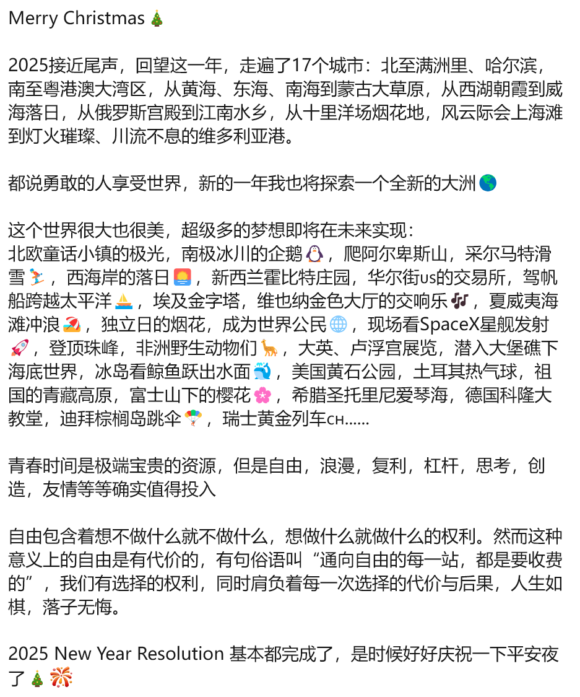

山路很长，石阶一层一层往上，隐在雾气里。那时我还小，每走一段就累了。父亲牵着我的手，不催我，只是停下来等我，再继续往前走。

爬到半路，我们遇见一个正在下山的人。

父亲问他：“山顶有什么？”

那人说：“没什么。就是一座亭子，和一个看风景的地方。”

我听了，有些失望。

那时我总觉得，爬这么高的山，山顶总该有点特别的东西，能让人觉得这一趟没有白来。

可他说，没什么。

父亲没有多说，仍旧牵着我往上走。

庐山的雾很轻，也很深。树影在雾里一层层退远，风从山谷里吹上来，带着湿润的凉意。我只记得石阶很高，腿很酸，很多次想停下来。父亲就站在前面等我，等我走近了，再把手递过来。

后来，我们终于到了山顶。

山顶确实没什么。

一座亭子。一个看风景的地方。

我往山下看了一眼。

群山在云雾里层层铺开，远处的长江、九江市都变得很小，很安静。云从山腰慢慢流过，风吹得人睁不开眼。天地很宽，万物很小。

我看了一会儿，风景确实很好。

但只是很好而已。并没有我想象中那种突然降临的震撼。山顶不过是山顶。

我们在山顶坐了一会儿，然后下山。

下山的路上，又遇见一个正在上山的人。

他气喘吁吁地问父亲：“山顶有什么？”

父亲笑了笑，说：“上去看看吧，其实没什么。就是一座亭子，和一个看风景的地方。”

那人问：“既然没什么，为什么还要上去？”

父亲转头看向我说：“因为‘没什么’这三个字，站在山脚说，和站在山顶说，不是一个意思。”

那人似乎不太满意这个回答，还是继续往上走了。

我站在一旁，看着他的背影慢慢消失在雾里。

很多年后，我才慢慢明白这句话。

人这一生，一直在爬一座座高山。

上山之前，总以为山顶有答案。

走到山顶，才知道那里未必有奇观。

或许是一座亭子。或许是一阵风。

或许只是一个可以回头看的地方。

可是，人还是要走一趟。

因为没走过的时候说“没什么”，是逃避；

走过之后再说“没什么”，是释怀。

有些话，不能替别人懂。

有些路，也不能别人代走。

风从山上来。雾往山下去。

人站在中间，才知道天地很大，自己很小。

看过山上的风景之后，山下的世界也变了。

山下还是山下。路还是路。人声还是人声。

可有些东西变远了，有些东西变轻了。

有些原本堵在心里的念头，也像雾一样，慢慢散开。

人见过高处，就难以察觉低处的喧哗。

人知道远方，就不会把眼前当成全部。

人走过长路，就不再对局部的得失动容。

后来我才懂，真正改变人的，不是山顶。

是上山的路，是回望的那一眼。

是一种俯视众生的慈悲。

所以，“没什么”这三个字，并不是一无所有。

那里有风，有路，有山顶的云☁️

## 附录八

今天就是二十岁的人了。

好像应该说点什么，最先想起的，还是我的故乡。

我的故乡是九江。

九江很小，小到装不下少年时我那颗躁动的心。

小时候的我经常盼望着走到天涯海角。我想爬很高的山，想走很远的路，想去全世界的中心。

九江也很大，大到我走了这么远，仍然没有走出它的山水。

这五六年来，南昌，上海，美国，我离故乡越来越远。现在的我似乎活成了曾经所梦想的样子：我不知道下个月的我会在哪，会看见什么样的风景，会遇见什么样的人，会碰见什么样的机遇，会增长多少钱……

可人走得越远，有些东西反而越近。

记忆不是被主动想起的。它常常藏在某种气味里，藏在某场雨前潮湿的风里，藏在一个忽然暗下来的傍晚里。也许只是一阵江风的凉意，我就会想起九江。

想起江边的晚风，想起庐山在远处沉默着。想起很多年前，我也曾在那样的风里走路，天色一点点暗下去，而我并不知道后来会看到这样既残酷又温柔的世界。

人总是要出去的，但是不一定有幸能够住回来。

如今，跟各种人聊天的时候，我总是会跟他们说，我来自一个在庐山和长江交汇处的小城。那里有山有水，那里有上海、香港没有的，也有圣何塞和波士顿没有的。

至于到底是什么，我也说不清……

或许是两湖的春夏秋冬，或许是南门口的九江小学和五中，或许是某个放学后的傍晚，天还没有完全黑，路边的店铺亮起灯，空气里有一点潮湿的味道。

或许是经常走过的小坝，后来去了很远的地方，才发现自己并没有真正离开过。

也许是很多年以后，我在异乡的某个瞬间，忽然想起自己原来是从那里出发的。

或许有些地方，不必常常回去，也一直在那里。

像水。像山。像那些年没来得及说出口的许多话……
