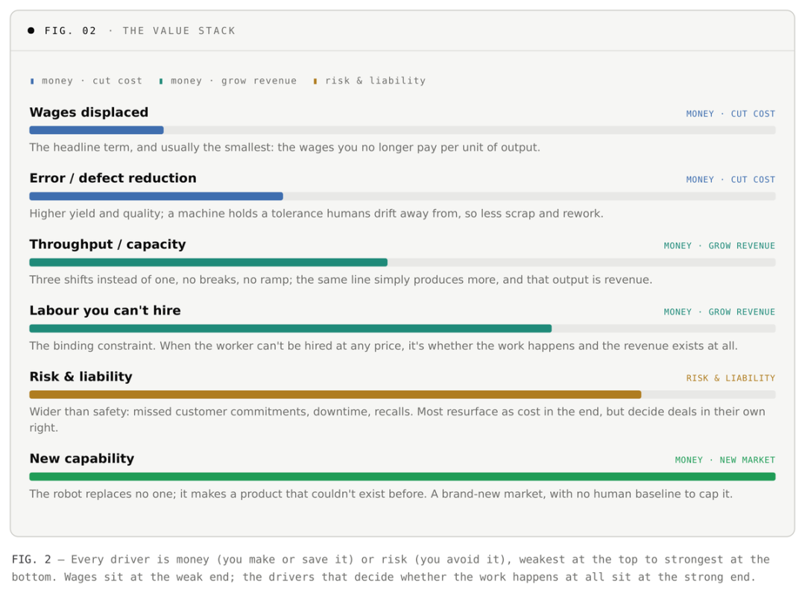
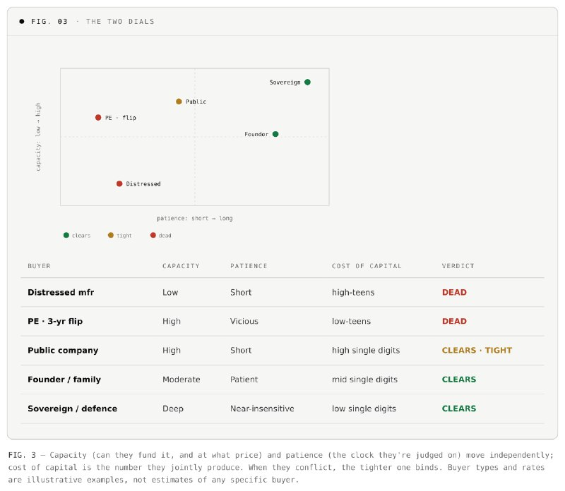
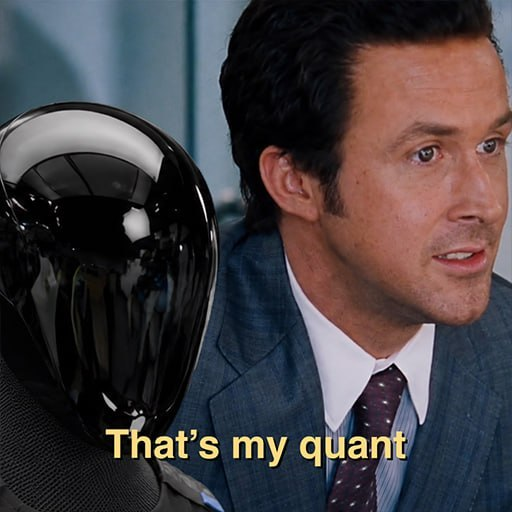
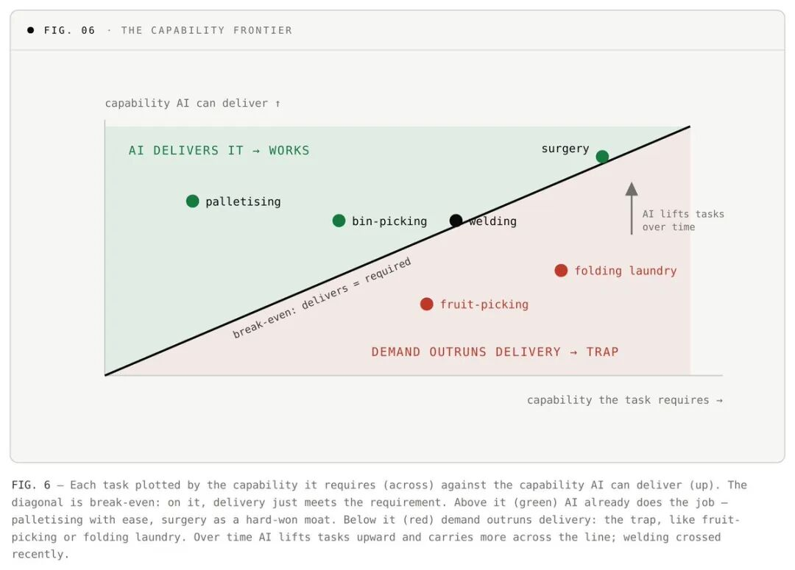
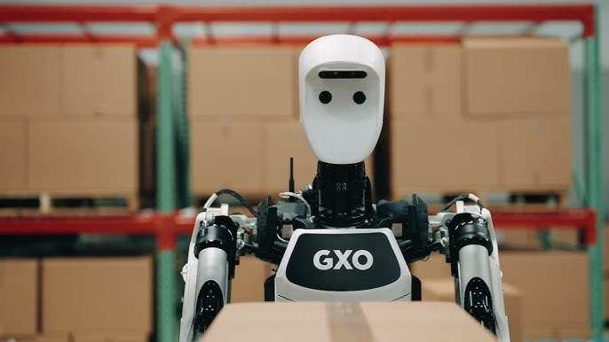

# 机器人公司怎样才算具备经济可行性？

> 来源：[微信公众号原文](https://mp.weixin.qq.com/s/ZDJDKMpTocVFmLNS4WxV2g)  
> 作者：supercuriosity  
> 发布：2026-06-26 22:37  
> 导入：2026-06-27

人形机器人，还是专用机器人：谁会赢？

这是每一场圆桌、每一份融资路演材料、每一张行业路线图都会争论的问题：

到底是通用型机器，还是专用型机器？

是人形机器人，还是其他一切形态？

很多人都想站队。押注谁会最终拿下市场。两边都有很强的声音，但在我看来，要回答这个问题，首先必须理解一件事：

到底是什么，让机器人具备经济价值？

机器人行业里有一个玩笑：

一台机器人一旦真正好用，它就不再被叫作机器人了。

它会获得一个具体的名字，比如洗碗机、汽车、洗衣机。

剥掉那些神秘感之后，机器人本质上就是一种工具：用合适的成本，交付某种价值。

于是，所有自动化决策最终都可以被压缩成一个关系：

自动化带来的价值，是否足以覆盖自动化的真实成本，并且越过买方的决策门槛。

理解这个框架，你就理解了如何打造一家成功的机器人公司。

这篇文章分为两部分：

第一部分，是这个框架本身。

第二部分，是这个框架可以帮助我们看清的一些问题。

# 第一部分：框架

只需要三个词。

价值。成本。门槛。

自动化某件事带来的价值，除以实现这件事所需的成本，必须越过某个门槛。

越过门槛，机器人就赢。

没越过，机器人就输。

这听起来很显然，也确实很显然。但现实中，大多数运营者、买家和投资人，并不会真的这样做决策。

# 支柱一：价值

## 分子：奖品到底是什么？

人们的本能，是把自动化的价值等同于节省下来的人工成本。

你和买方沟通时，他们会对其他所有好处点头，但最后做决定时，往往还是锚定在“能少雇几个人”。

这会让很多真正的价值被忽略。

要看清完整的奖品，需要往上看一层。

价值最终可以归结为两件事：

钱，或者风险。

要么它创造钱：降低成本，或者增加收入。

要么它降低风险：减少责任、降低安全暴露、避免那些可能严重出错的事情。

当然，风险最后通常也会折算成钱。毕竟，这是商业。

机器人行业真正的关键，不是把自己困在一个单纯的“人工套利”故事里，而是要沿着价值栈向上爬，去靠近那些更难被竞争抹平的价值驱动因素。

## 心智模型：真正的约束点

在任何系统里，总有一件事限制着整个系统的速度。

它就是瓶颈。

如果你缓解了这个约束，整个系统都会动起来。

如果你改善的是其他地方，可能什么都不会发生。

关键在于找到那个真正起约束作用的因素。

因为花在其他地方的努力，都是浪费。

## 劳动力供给，往往就是那个约束点

在很多体力劳动场景里，劳动力就是核心瓶颈。

当劳动力是瓶颈时，大家常用的比较方式——“人力成本 vs. 机器人成本”——其实悄悄失效了。

因为根本没有一个“人”可以拿来比较。

你找不到焊工，找不到机加工师傅，也找不到愿意上夜班的拣货员。无论你出多少钱，都招不到。

所以，机器人并不是在帮你节省一份工资。

它决定的是：

这项工作到底能不能发生。

是收入可以被确认，还是订单直接流失。

灵活性和产能，也是同样的逻辑。

一条可以无人值守、全天候运转、或者按需快速扩产的产线，它的价值来自于额外产能所释放的收入。

这最终仍然会回到钱。

只不过，它不是你削掉的成本，而是你原本无法获得的收入。

  

## 新能力：没有天花板的价值

一些最有价值的机器人，并不是在替代人。

比如：

5 轴 3D 打印。

MEMS 尺度的微型装配。

微重力环境下的制造。

这些并不是把某个现有工作做得更便宜。

它们是在创造一种以前不存在的产品，甚至创造一个以前不存在的市场。

因为没有被替代的劳动力，所以用工资来衡量价值毫无意义。

它们的价值，是一个全新的可触达市场。

而且，由于没有人类基准可供比较，原则上，它的上限是开放的。

## 替代，还是创造新能力？

替代，是以更低成本完成已有工作。

它有一个优点：需求是确定存在的。因为这项工作已经有人在付钱购买。

但它也有一个缺点：价值会商品化。

随着技术变便宜，竞争者会不断涌入，利润率会被侵蚀。

创造新能力，则不同。

它一开始没有商品化风险，因为你不是在争夺现有类别的一部分，而是在定义一个新类别。

但它的风险是：

需求必须从零开始被创造出来。

“技术惊艳，但没人买单”的坟场里，躺满了这样的项目。

这里没有绝对正确的答案。

只要你清楚自己选的是哪一种毒药。

# 支柱二：成本

## 分母：真正需要付出的是什么？

自动化成本，不是机器的标价。

它是让这件东西真正在现场跑起来的全部成本。

## 先把它造出来

这是固定成本。

在第一台设备交付之前就已经发生，之后会被摊到你未来卖出的所有设备上。

开发成本

AI / 软件栈、训练数据、仿真环境。

这是深层技术建设，在第一台设备出货前很久就已经投入。

认证成本

FDA、AS9100、ITAR 等。

进入时缓慢且昂贵，但一旦拿到，也会成为护城河。

组织开销

两笔交易之间，你仍然需要持续供养的人和基础设施。

管理层、G&A、办公场地、常设销售团队和工程团队。

它并不能干净地按单台设备或单个客户摊销。

它是维持公司运转的成本。

## 把它落地到客户那里

这是每个客户都会重新发生的变量成本。

获客成本

销售周期、POC、试点项目，最终拿下合同的成本。

这是机器人行业最容易被低估的一项。

客户获取非常昂贵，而且可能长时间处于亏损状态。

如果一个模型默认“交易已经赢了”，那它很可能跳过了最大的一条成本线。

集成成本

合同签完之后，还要把系统适配到客户的现场、流程和工作流中。

## 让它持续运行

这是每台部署机器在整个生命周期里都会反复发生的变量成本。

单机硬件成本（BOM）

也就是机器本身的制造成本。

这是按台计算的，随着规模变化而变化，也是很多系统中最大的一项成本。

“不要只看机器标价”这个说法，往往会悄悄漏掉这一项。

运行成本

每台机器只要运行，就会消耗资源。

能源、压缩空气、耗材、末端执行器和工具磨损，以及越来越重要的 AI 推理和算力负载。

这是持续发生的单机成本，不是一次性的支持费用。

维护成本

让机器持续运行的成本。

服务、备件、维修、异常情况处理，以及持续的人类监督。

停机与故障成本

这是最容易杀死交易的一项。

当产线因为安装机器人而停下来，或者因为机器人故障而停下来时，客户承担的是生产损失。

在真实工厂里，这个损失可能达到每小时数十万美元。

在最大的工厂里，甚至可能达到数百万美元。

而且，故障的后果会随着场景的重要性而放大。

一端是掉了一个箱子。

另一端是病人死亡。

黑天鹅，就藏在这里。

  

## 昂贵，不等于买不起

这两个词经常被混在一起用，但它们不是一回事。

昂贵，是关于机器人本身。

它需要大量资源去制造和运行。

解决方式是工程能力：更好的设计、更大的规模、更便宜的硬件，都会把成本打下来。

买不起，是关于买方。

即使价格公平，买方也可能拿不出这笔钱，或者无法在自己的时间尺度内证明这笔投入合理。

解决方式不是工程，而是融资。

如果把这两者混淆，你可能会花很多年试图用工程手段解决一个融资问题。

或者反过来，用打折去解决一个工程问题。

这就引出了第三个支柱：门槛。

# 支柱三：门槛

## 仅仅做到“价值大于成本”还不够

价值与成本之比等于 1，意味着刚好打平。

机器人只是刚好回本。

但这并不是购买它的理由。

这个比值必须高于 1。

至于要高出多少，就是门槛。

这个门槛对每个买方都不同。

所以，把它当成一个教科书式的“资本成本”来处理，是最常见的错误。

两个买方面对完全相同的机会：

同样的劳动力短缺。

同样的缺陷风险。

同样的机器。

同样的价格。

但他们在行动之前，可能会要求完全不同的回报。

门槛不是由“他们有多需要机器人”决定的。

门槛是由这笔决策背后的资本决定的。

而这可以拆成两个相互独立的旋钮。

## 旋钮一：闸门

### 资金能力：他们能不能付钱？以什么价格付钱？

这是买方获得资本的能力。

强劲的资产负债表、低成本信贷、充足的自由现金流，意味着这张支票可以轻松开出。

脆弱的资产负债表、高杠杆、没有信贷渠道，则意味着一笔正 ROI 的交易仍然可能失败。

不是因为数学不对。

而是因为买方没有能力出资。

资金能力也是你可以通过商业模式去“工程化”解决的旋钮，因此它更具可操作性。

RaaS（机器人即服务）不是一个定价小技巧。

它是一种金融工具，目标正是这个问题。

它把买方无法跨越的资本开支门槛，转化为可以承担的运营开支项目。

也就是说，它在资产负债表不给力的地方，人为制造了资金能力。

## 旋钮二：时钟

### 耐心：这笔投资会按多长周期被评估？

这是决策者被考核的时间周期。

而这个周期，几乎从来不是资产的经济寿命。

签字的人，并不会真的基于机器十年生命周期做一个干净的 NPV 计算。

他们优化的是自己被评估的那只时钟。

私募基金如果计划三年后退出，会非常苛刻。

退出之后发生的收益，是下一个所有者的问题。

上市公司如果被季度 EPS 牵着走，时间尺度就很短。

创始人或家族企业，可能有耐心承受十年回本周期。

政府、国防或任务驱动型买家，几乎对回报周期不敏感。

他们的时钟由任务设定，而不是由财务回报设定。

“耐心”是最偏离教科书理性的旋钮。

也正因为如此，很多人会错过它。

## 资本成本是结果，不是第三个旋钮

资本成本并不是一个单独的决定因素。

它是前面两个旋钮共同作用的结果。

薄弱的资产负债表，不只是会卡住交易。

它还会提高资金价格，因为风险更高的借款人需要支付更高的成本。

缺乏耐心的所有者，会更重地折现未来收益。

资金能力和耐心是输入。

资本成本，是它们共同呈现出来的结果。

## 真正的筛选问题

所以，真正的筛选不是一个简单的 ROI 数字。

而是两个问题：

第一，他们能不能出资？

这叫资金能力。

第二，他们被什么时间周期考核？

这叫耐心。

一个很漂亮的价值 / 成本比，如果遇上一个极其残酷的门槛，仍然是一笔死掉的交易。

# 原来一切都是净现值

就像开头承诺的，这里给出完整公式。

但这篇文章的目标，是让非金融背景的人也能用这个框架。

所以我们先从头说起。

首先，什么是 NPV？

钱有时间价值。

今天在你手上的一美元，比一年后的一美元更值钱。

因为今天的一美元可以被拿去投资，明年变成更多钱。

因为你不想等待。

也因为未来那一美元可能根本不会到来。

所以，当你用今天的一大笔支出，去换未来几年分散发生的收益时，不能简单把未来收益加总。

越晚发生的收益，今天看起来价值越低。

净现值就是为了解决这个问题。

你把未来每一年产生的现金流，折现回今天的价值。

再把整个现金流加总。

最后减去一开始投入的资本。

结果为正：项目创造价值，应该做。

结果为负：项目损毁价值，应该放弃。

这几乎是金融世界最接近通用“是 / 否”判断的工具。

也正因为如此，几乎所有严肃的资本决策——无论是不是机器人——最终都会回到它。

这个公式可以简化为三件事：

它赚到的现金流 CF。

用于定价等待和风险的折现率 r，作用在 T 年周期上。

以及一开始投入的资本 C₀。

这正好就是我们的框架。

而对机器人来说，真正重要的是：

其中两个变量，r 和 T，并不是机器人的属性。

它们属于买方。

这就是为什么同一台机器，在一个客户那里可以通过，在另一个客户那里却会死掉。

它们就是第三支柱里的两个旋钮。

  

# 第二部分：把框架用起来

接下来所有内容，都是把同一个公式指向真实机会的一种方式。

# 01

## 杠杆：AI 的首要杠杆是成本

在今天影响这个框架的所有力量中，AI 是最大的力量。

而它最强烈拉动的，是一个杠杆：

成本。

AI 的主要作用，是降低自动化成本。

它并不会把任务本身推向更高价值。

基础模型降低了单任务开发成本。

Sim-to-real 降低了物理训练成本。

更好的感知能力，让系统可以吸收更多现实世界的变化，而不需要每次都做定制工程。

迁移学习让一个任务上的开发成本，可以被带到下一个任务中。

但 AI 对价值端的推动要慢得多。

焊工短缺不会因为模型更强而消失。

工资也不会因为模型进步而下降。

唯一的例外是：

当 AI 能够带来超越人类能力的良率或质量时，它会创造以前不存在的价值。

这是真实存在的影响。

但相比成本下降，它仍然更小。

这就是具身 AI 真正的经济效应：

它不是让机器人更有价值，而是让机器人更便宜。

每一次成本下降，都会把更多应用拖过“值得做”的那条线。

# 02

## 一个该退休的代理指标：产量曾经好用，但它不是真正的测试

几乎每个人都有一个本能判断：

高产量，适合自动化。

低产量，不适合自动化。

这个判断来自真实的历史。

最容易理解的方式，是看三个层级。

一条专用灌装线，是纯粹的固定自动化：

一个任务，每年数百万件产量。

它只有在这个规模下才划算。

往下一层，一个 6 轴机械臂不是为单一任务专门打造的。

但为了部署它所需的夹具、工具和编程，仍然只有在数万到数十万件产量时才算得过来。

再往下，自动化过去根本不可行。

在那个世界里，产量确实是一个不错的代理指标，用来判断“这件事能不能被自动化”。

这也是为什么自动化程度最高的行业，通常是产量最高的行业：

汽车、制药、食品饮料。

但有两件事打破了这个代理指标。

第一，AI 正在把成本曲线往下拖。

这正是我们刚刚看到的。

因此，自动化能够算得过来的产量门槛，会不断下降。

第二，也是更重要的一点：

真正重要的数字，不是你卖出多少台机器。

而是这个任务会运行多少次，以及每一次运行值多少钱。

只要每次运行的价值足够高，数量很小也可以算得过来。

一套外科手术系统，在生命周期内可能只做几千台手术。

它不像灌装线那样跑出数百万次循环。

但每一台手术的价值都非常高：

外科医生时间、责任风险、治疗结果。

这些价值足以让机器多次收回成本。

航空航天和国防也是同样逻辑。

一个工作单元一年可能只铺放几百根翼梁，或者只焊接少量发动机组件。

但每一个都极其昂贵。

真正跑一遍框架——价值除以成本，再对照门槛——你就不再需要那个代理指标了。

# 03

## 复杂度：复杂度同时驱动价值和成本

价值和成本，看起来像两个彼此独立的杠杆。

但如果你观察它们之间的关系，会发现有一个隐藏变量同时推动两者：

复杂度。

更高的复杂度会提高成本。

需要更多开发。

更多传感器。

更多自由度。

更困难的集成。

更长的部署周期。

到最后，甚至会抵达一个无论花多少钱都跨不过去的技术前沿。

但同一个复杂度，也会提高价值。

被替代的劳动力更稀缺，也更昂贵。

人类错误率更高，因此可恢复的良率更多。

能做这项工作的人本来就更少。

所以问题从来不是：

“这件事复杂吗？”

真正的问题是：

复杂度让哪一边增长得更快？

是价值增长得更快？

还是成本增长得更快？

## 从输入和输出开始看

要判断一个真实任务，需要把两件事分开：

世界提供输入。

机器人必须提供输出。

输入，描述的是任务本身有多难。

输出，描述的是机器人需要具备什么能力。

输入告诉你，这个市场有多难。

输出告诉你，这家公司必须有多强。

整个问题，就是所需能力与今天可交付能力之间的差距。

  

## 输入：任务侧

流程复杂度。

零件差异性。

环境变化性。

监管负担。

故障成本。

只能靠经验和手感习得的隐性知识。

## 输出：机器人侧

灵巧性。

精度。

感知能力。

速度。

可靠性。

适应性。

## 外科手术，是复杂度双刃剑的证明

如果用一种天真的视角来看，外科手术会显得像一个极差的自动化目标：

难到离谱。

产量很小。

但如果用价值 / 成本的视角看，它会翻转成机器人行业最好的商业之一。

因为每一次使用的价值太高，足以淹没成本。

永远不要只把复杂度读成成本。

真正重要的，是哪一条边跑得更快。

# 04

## 两个阵营都会赢：通用型 vs. 专用型

现在，开头那个问题终于可以落地了。

专用型和通用型，并不是两种彼此敌对的哲学。

它们是通往同一个目标区域——Q1——的两条路径。

每一条路径，都适合不同类型的任务。

真正的判断问题，是这个框架里的问题：

这个任务能否独立越过门槛？

还是说，它只有作为一组任务的一部分，才有经济意义？

有时，决定因素甚至不是经济性本身。

如果工作变化太多。

如果任务组合不断改变。

如果固定机器根本无法适应它必须工作的空间。

那么你就需要一个通用、可适应的平台，无论产量有多大。

专用型机器人，直接作用于成本轴：

缩窄任务，降低成本，先赢下来。

通用型机器人，则把固定成本摊到多个工作上。

并且在固定机器无法适配的地方，提供灵活性。

所以，是的，这听起来像是在和稀泥。

但真实世界就是有细节。

我相信，未来通用型机器人和专用型机器人，都会强有力地越过门槛。

# 05

## 路径选择：先深后宽，还是先宽后深？

最优秀的运营者，正在趋向一种“先深后宽”的路径。

先赢下一个具体的高价值任务。

也就是以专用型切入。

然后积累数据、收入和运营可信度。

再向外扩展。

扩展资金来自真实利润，而不只是外部资本。

复利效应才是重点。

收入为开发提供资金。

真实运营中的部署数据，会改善模型。

客户关系会形成锁定和扩张机会。

一个领域里的认证，也会为下一个领域建立可信度。

一个典型案例是：

用通用型硬件形态，搭配狭窄的专用型市场切入。

比如，一个人形机器人身体，先被部署在单一高产量任务上。

这就是穿着通用型外衣的“先深后宽”。

身体是未来广度的战略期权，而不是当下的产品本身。

相反的赌注，是“先宽后深”：

从第一天起就覆盖很多任务。

但这只有在一个通用模型能够在每一个单独任务上打败专家系统时才成立。

而今天，它还做不到。

实验室到现场的落差，大约是：

实验室里 95%。

现场里 80%。

而这个落差，会独立作用在每一个任务上。

所以，先宽后深会把风险一次性叠加到整个任务集合上。

先深后宽，则在技术成熟过程中持续产生回报。

先宽后深，则在技术成熟之前持续消耗资本。

# 结语

## 所有模型都是错的，但有些模型是有用的

一个框架就是一个模型。

而每个模型都是错的。

这一个也不例外。

它不会告诉你谁一定会赢。

它能给你的，是一把手术刀：

一种量化那些通常无法量化之事的方法。

一种切开机器人神秘感的方式。

最后留下的，其实只有一件事：

机器必须交付净价值。除此之外，没有别的。

  

机器人是 ROI 的工具。

要让一家机器人公司具备经济可行性，你只有三个杠杆。

当然，这三个杠杆可以有一百万种组合方式。

## 提高价值

沿着价值栈向上爬。

不要停留在节省工资，而要走向产能、风险，以及世界无法通过其他方式获得的新能力。

## 降低成本

通过工程把成本打下来。

同时让 AI 持续拖低成本曲线，让更多应用越过“值得做”的边界。

## 找到低门槛买方

把产品卖给那些既有能力出资、又有耐心等待回报的资本。

或者，重新设计交易结构，直到它能被买方接受
