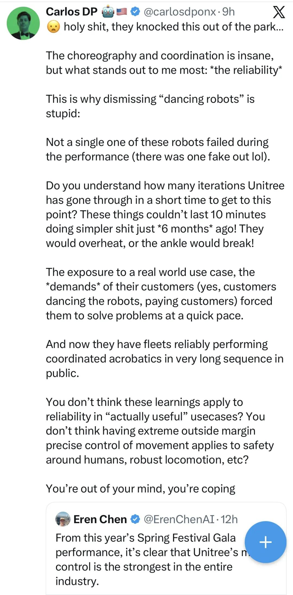
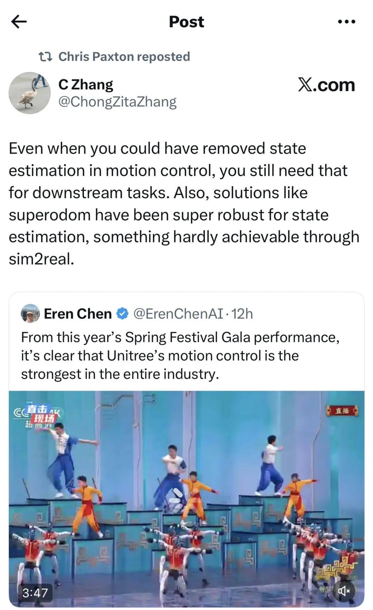
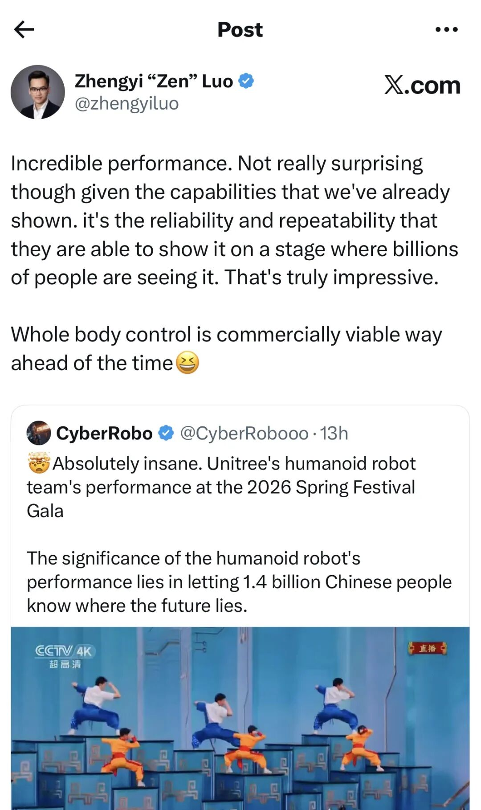
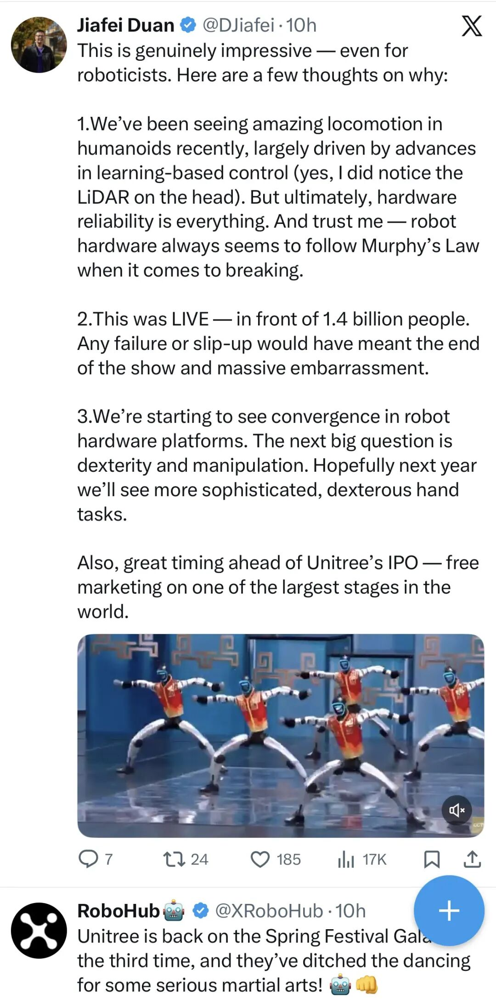

# 闲谈春晚机器人

> 来源：[微信公众号原文](https://mp.weixin.qq.com/s/r0HTUb49wWE4Uxh30NvcZA)
> 作者：supercuriosity
> 发布：2026-02-18 09:48
> 导入：2026-06-27

今年春晚播完，亲戚吐槽最多的一句话是：“别说没年味，连人味都没了。”

有没有发现一个现象？今年春晚舞台上，最抢戏、最出风头的根本不是哪位流量明星，而是机器人。

普通人看个热闹，觉得“现在的科技真发达”。但如果我们从经济和投资的视角去拆解，这根本不是春晚导演组突然变成了科技发烧友。底盘的逻辑极其冷酷且现实：现在的中国经济，需要去找新的主角了。 当房地产不再适合登台唱主旋律，硬科技就必须得学会硬着头皮上台，把“未来”直接演给全国老百姓看。

今天，我们就扒开这层“合家欢”的文娱表象，聊聊机器人上春晚背后，真正藏着的经济脉络与商业逻辑。

  

## 春晚本质上是cn的国家级“注意力交易所”：把品牌塞进全民记忆盘。

众所周知，春晚从来就不是一个简单的文艺晚会。在商业分析眼里，它是中国一年一度的“国家级注意力交易所”。

这组数据大家可以细品：截止到2月17日晚8点前，春晚光境内的全媒体累计触达高达 230.63亿次，电视直播收视份额 79.29%。每分钟在线收看人数高达 3.25亿，峰值甚至突破4亿。

这是什么概念？这就相当于，你在上面露一次脸，全国十几亿人，包括从北上广深写字楼里的白领，到十八线县城甚至村口大爷，都在同一时间盯着你。它是极其稀缺的国民级入口。

在这种量级的聚光灯下，机器人赛道登台，就是在强行把自己的品牌和产业概念，塞进全国人民的“共同记忆盘”里。但这仅仅是表象，更狠的博弈，其实在台下。

## 春晚是IPO路演现场：零容错的“地狱级压力测试”。

朋友一直说，这次春晚，本质上就是机器人行业的一场史诗级IPO路演。它根本不是什么才艺表演。

很多观众还在评价“今天这机器人跳舞又整齐了点”，这根本不重要。做过硬件创业的人都说，这行最怕什么？最怕投资人和客户说你是“PPT造车”、“PPT造人”。在机器人这个赛道，最贵的零件从来不是高精度的电机，也不是激光雷达传感器，而是“可信度”。

春晚是一个什么样的场景？直播级别、全国瞩目、零容错。

现场灯光极其复杂、信号干扰极强、人群密集、舞台随时在变，而且你还得一镜到底，配合演职人员绝对不能翻车。在这种地狱难度里跑完一整套动作，机器人公司相当于对着全国的投资机构、采购方、地方政府拍着胸脯交了底：“看清楚了，我这不是只能供着观赏的玩具，我这是一个高度成熟的工业产品。”

这是拿命在做公开的压力测试。这些机器人全须全尾地走下春晚舞台，对公司来说，就是把产品的“可靠性”死死地刻进了全国人民的认知里。

更深一层看，机器人登台是带着“国家意志”来的。光是机器人这一块，国家层面直接拉了17个部门一起去推，明确要在制造业、医疗健康、养老、应急等领域做规模化应用。小品里机器人在干嘛？在干家务、在陪老人。这传递的信号极其清晰：这不是为了炫技，这是在把未来产业的“合法性”，直接写进全民叙事里。

政策是吹动产业的风，而春晚，做了一次震耳欲聋的扩音器。

  

## 反映着资本的焦虑：花上亿买下未来三年的“定价权”。

央视在这里扮演的，已经不仅仅是发一个镜头的媒体，它是“产业筛选器”，更是在发通行证。

能上台，说明你的技术、稳定性、供应链和现场保障全通关了。这种背书带来的转化是恐怖的。大家可以去查一下数据：春晚开播两小时内，京东平台上机器人相关搜索环比暴增超 300%，客服问询量激增 460%，订单量直接飙升 150%。最可怕的是，新增订单覆盖了全国100多个城市，从一线大城市到下沉县城，都在真金白银地买单。

以前春晚带货，带的是毛衣、大衣，或者是某款色号的口红；现在春晚带货，带的是“生产力”。 它一脚踏平了三四线城市对机器人的认知门槛。

那么问题来了，外界盛传机器人公司想上春晚，合作费用动辄上亿，甚至还有激烈的竞价、抢名头、卡位赛。为什么砸几个亿也有人抢着上？

做投资的分析地太清楚了：资本博弈的核心，就是“时间窗口的焦虑”。

现在机器人赛道热得发烫，融了无数的钱。人形机器人现在的处境，像极了早年的新能源汽车（蔚小理时代）。这个赛道的第一梯队一旦坐稳，马太效应就会极度放大：你的后续融资会更顺，拿到B端/G端的订单会更大，排队上市的节奏会更快。连“行业代表”这四个字，都会因为你上了春晚而被提前占坑。

你不去上台，别人就替你写历史。 春晚的门票确实贵到离谱，但这些顶尖科技公司买的根本不是除夕夜的那3分钟曝光，他们买的是接下来3年，在这个赛道里说一不二的融资定价权。

  

## 借这个撕开底盘：中国经济结构的“换角大戏”。

如果我们把视角拔高到宏观层面，真正的底盘是什么？

是老龄化带来的劳动力绝对紧缺；是制造业升级急需更稳定的质量和更低的边际成本；是未来某一天AI大模型的爆发，把机器人的“大脑”补齐了，而具身智能又可以把“四肢”补齐了。

机器人频繁上春晚，绝不是审美偏好变了，而是整个中国经济结构正在进行一场轰轰烈烈的换角。它不再是一个极客圈的玩具产业，它是下一代生产力的超级接口。

当房地产的周期过去，我们需要一个足够硬、足够有想象力、产业链足够长的新增长点来接棒，而国家把宝压在了这些产业身上。

大年三十这天晚上，台上是五彩斑斓的节目，普通老百姓看的是热闹；台下是真金白银的订单，台外是一个国家在为下一轮的国运增长，精心挑选新主角。

最后，还是来一句犀利一点的：市场要的不是玩具，是永不疲劳的下一代印钞机。

  

