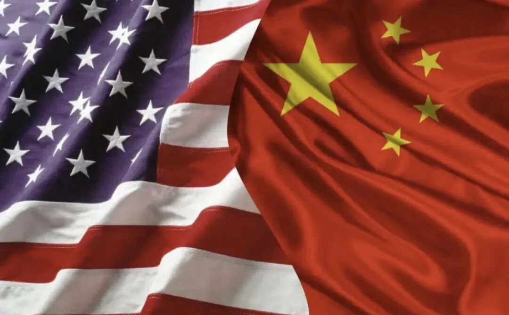
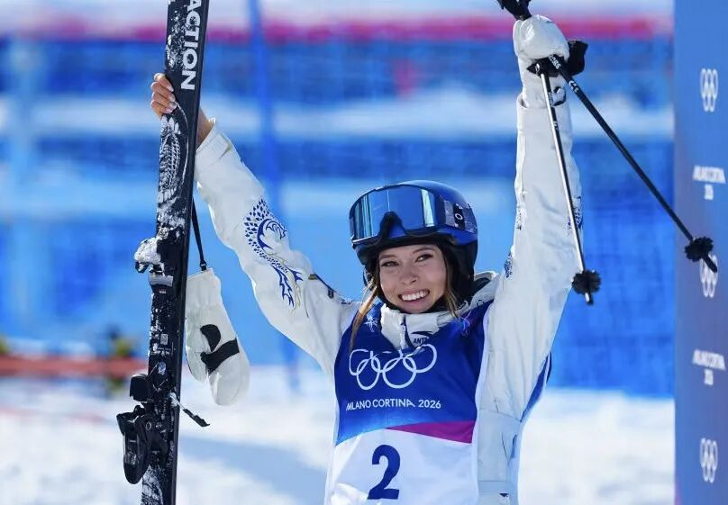

# 闲谈“谷爱凌”

> 来源：[微信公众号原文](https://mp.weixin.qq.com/s/xyVS0V-c5pPGcuHXJbZzJw)
> 作者：supercuriosity
> 发布：2026-02-23 13:50
> 导入：2026-06-27

冬奥会谷爱凌又出来了，且不谈她精彩的表现，精明的策略和多样的配置，客观分析一下她就像一个典型的成功投资项目，值得去好好分析一下，确实有一下值得思考的point

## 第一，评估赛道，确定战略

谷爱凌她妈妈叫谷燕，绝对是一个顶级的VC投资的打法，她妈妈做的这些决策方式像极了顶级风险投资。VC最重要的能力是什么呢？从来不是写PPT，是会挑赛道、会压趋势、会做错位竞争。想想看，如果谷爱凌当初选的是花样滑冰，或者选的是乒乓球，会怎么样？那么她会真正的杀入红海。你再努力，身边永远有人比你更早开始，比你更密集的训练，更卷。更关键的是，赛道极其拥挤，资源也极其拥挤，评价体系更加拥挤，你想出头那就太难了，就跟高考似的，就跟现在春运抢火车票一样，怀疑人生。

她选的是自由式滑雪，尤其是那种又酷又年轻又有时尚感的项目，相对小众，但是商业化潜力巨大。全球观众愿意看，而且不分国籍，可以为任何一个国家效力，品牌也愿意投，而且是女性顶尖竞争者相对没有那么密密麻麻。这是典型的VC逻辑，不是在红海里死磕，而是去增量市场里面当头部。VC怎么去拆一个项目？第一评估赛道，也就是选择项目。投资人看一个赛道会问几个问题：比方说这个市场大不大？增长快不快？门槛高不高？头部是否稀缺？能不能被看见？未来有没有退出机制？
那么放在这个运动上就知道，首先这个项目有没有全球舞台？有没有奥运这样的一种超大流量的入口、超大杠杆的入口？有没有足够强的传播性？有没有跟商业品牌天然匹配的气质？你会发现自由式滑雪这套东西天然适合像短视频啊、广告啊、媒体，适合“酷、自由”这样的叙事。不要小看叙事，叙事就是现金流，叙事就是挣钱，趋势就是商业化。能讲清楚你是谁，世界会给你价格。

  

第二个事就是注入资源，也就是我们说的VC的投后管理。选对赛道只是第一步，那VC还要做一个事，就是把资源砸到杠杆点上。什么叫杠杆点呢？要有杠杆思维，不是平均用力，不是哪里都补一点，而是要找到最能改变结果那几个按钮。比方说教练体系，比方说训练环境，比方说国际比赛经验，比方说从美国长大回中国去比赛，这些关键节点的动作升级。很多家长对教育的误区是什么？像撒芝麻，英语也报，钢琴也报，奥数也报，做这个孩子像被开了100个网页的电脑，这风扇开始狂转，最后就给烧了，页面全卡。VC的打法非常非常的相反，少投但是投得很准，每投一个都有杠杆，投到就能拉开差距，而且找到关键点。
第三个事就是合适的时机去完成IPO，也就是冬奥夺冠之后的商业化。VC要什么？要退出嘛。你投了你不能不退出。要流动性，要把价值变成现实。对运动员来说呢，冬奥会就是那种超级IPO的敲钟。你在那一刻不只是拿金牌，是把你过去所有的训练、资源啊、价值统一定价。所以就会发现一个很扎心的事实：很多人在高考这个独木桥上拼命，其实也并不是不努力，是赛道不同。你跟别人抢一张椅子，他在搭建一个更大的舞台。所以如果你总跟别人抢，那你就必须要学会换桌子吃饭。你拼到天亮，可能只是把自己拼成了一个更好的内卷选手。而真正的高手是去找一个风口，正在起来的蓝海，然后成为那个被风口抬起来的人。选择永远大于努力。赛道是永远大于速度的，错位竞争才是她的捷径。

## 第二，反脆弱，谷爱凌的资产配置

谷爱凌给我最大的启发，就是“反脆弱”。反脆弱的人生资产配置太厉害了，对冲思维。投资里有一句老话叫“别把鸡蛋放一个篮子里面”，人生也是一样的。谷爱凌最厉害的地方不是她滑的好，是她还做了一套非常高级的人生配置资产，大家去看，她像是一个三资产的组合：

滑雪冠军——她是一个高风险高收益，就我们叫阿尔法收益，赢了就爆炸，输了也爆炸。
但她去斯坦福读书——是一个非常稳健的基本盘，我们叫贝塔收益。贝塔收益就是指数基金稳稳的托底。
然后她还进了时尚圈——全世界还传她进了什么VC圈，但这不重要，时尚圈和公众影响力是什么？是杠杆，是可变现的期权，是把影响力转化成现金流的发动机。

你看这三者互相加固，互为护城河。你滑雪厉害，品牌更愿意找你；你有学业背景，你的影响更立体；你有影响力，反过来让你在赛场上更有资源，更有信心。所以这并不是兴趣广泛啊，这是一套非常非常典型的反脆弱的系统。
她越是学会多条腿站着，她越不怕一条腿抽筋。所以更关键的来了，极限运动确实有时候会失败，会受伤，会有很大的不确定性。所以很多人说谷爱凌能保持那么强烈的这种笑容和松弛感？很简单，因为在这种杠杆下，她的容错率很高。她有安全网，对吧？大不了回斯坦福读书嘛，我有很多退路。有安全网的人才敢跳高难度，没有安全网的人摔倒都不敢，摔一下就再起不来了。所以她给我上的一课是，成长的关键从来不是逼自己去走唯一的独木桥，而是要给自己构建多维度的支撑。越能够承受回撤，越敢追求上限。

  

所以很多人看比赛只看到因为她赢了，她输了，这都不重要。我倾向于看她是怎么处理这3轮比赛的。这三轮比赛就像投资里的三次出手，第一轮失误了，不等于你项目归零了。关键是有没机会干第二次第三次，有没有第二次第三次融资的机会？能不能快速的复盘迭代动作，重新上场？她的夺冠逻辑，其实就是允许试错，但是必须迭代，而且有退路。会赢的人，不是从不犯错的人，是犯错成本最低的人。人生其实不是非黑即白，早期的她可以分散一些试错，找到自己的优势赛道；中期她集中打爆点，做出自己的名声；后期她分散，做对冲建立系统。所以多给自己一条腿，就多一份胆量，安全网就越大，跳的就越高。

## 第三，保护精力池（睡好觉）

谷爱凌最常被提到的一句话，就是：她每天要睡够10个小时。这个在东亚语境里就像是叛徒，我们从小听到的是头悬梁锥刺股。但是她的成功相当科学：在高强度的热爱和专注面前，堆砌时间毫无意义，内卷毫无意义。你以为她拼的是时间，其实她拼的是神经系统。脑子就像CPU，睡眠像散热。你散热不够，再好的CPU也会降频。最后并不是不努力，是系统过热了。
她把精力像资产一样去精明管理，精力是第一位。保护她的精力池，保护她的内驱力。所以反内卷并不是躺平，反内卷是用高质量的精力去用力。该冲的时候冲，该睡的时候睡，睡醒了再升级。
她这样的顶级选手拼的从来不是谁更吃苦。我们老有一句特别低效的话，叫“吃得苦中苦方为人上人”，怎么可能呢？她们拼的从来不是吃苦，是谁能稳定输出。时间是表面，精力是底盘，底盘不稳，速度越快，越容易翻车。
精明的谷爱凌教会我三件事：
第一件事，定战略选赛道，别天天在红海里跟人抢口饭吃。
第二，做资产配置，至少三条腿走路，别把自己的人生压在一张牌上，给自己留后路。
第三，像管理资产一样管好自己的睡眠，管好自己的身体。
她背后是一套自带杠杆的系统。这个系统一搭起来，她的人生不是被推着走的，自动的就上了一个往上走的一个电梯的轨道。她有了选择权，选择权才是真正的自由。
